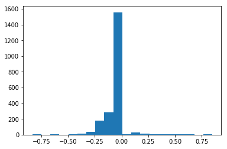
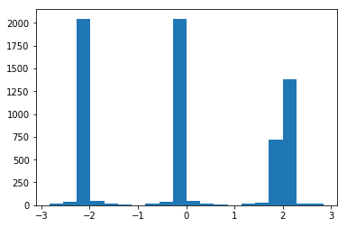
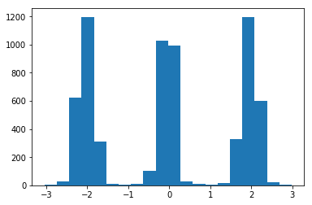

# Behavioral Cloning Project

Goal of this project is to model and train a neuronal network to successfully
drive a car around a track in a simulator. This document describes the
architecture of the model as well as the challenges of the training and
which steps have been performed to overcome shortcomings.

## Content

### model.py
A python script to define and train the model. It has several parameters
(loading, data-path, number of epochs, augmentation, validation, ...) which can be
used to efficiently train the model with multiple dataset without modifying the script
itself.

### drive.py
This is used to run the car in the simulator. It uses the trained model to
predict an steering-wheel-angle and has a simple pi-controller-implementation
to keep the car at a constant speed.

### model.h5
This file contains the model definition as well as the trained weights. The model
stored in model.h5 is used by 'drive.py' to predict the steering-wheel-angle.

### video.mp4
Demonstration video of the car running around the the track autonomously.

## Model architecture

I started with a very simple model, but during training it evolved towards the
model that is NVIDIA presented in their paper on autonomous driving. [^1] In the
end I am working with a model that is very similar to what NVIDIA is using, but
on a smaller scale (smaller number of nodes per layer) which reduces learning times
dramatically.

The final model [^2] looks like this:

- Cropping2D to remove sky/trees/... and the hood of the car from the image
- Normalization (0..255 -> -0.5..0.5)
- Convolutional layer, 10 Filters, 5x5, relu-activation
- Maximum pooling, 2x2
- Convolutional layer, 20 Filters, 5x5, relu-activation
- Maximum pooling, 2x2
- Convolutional layer, 26 Filters, 5x5, relu-activation
- Dropout 50%
- Convolutional layer, 28 Filters, 5x5, relu-activation
- Dropout 50%
- Flatten
- Normal layer, 30 Nodes, linear-activation
- Dropout 20%
- Normal layer, 20 Nodes, linear-activation
- Dropout 20%
- Normal layer, 10 Nodes, linear-activation
- Dropout 20%
- Normal layer, 1 Node (output)

## Design decisions

### Dropout

My initial model did not contain so many layers with Dropout, but even with a big
number of training samples the model started to overfit. Especially it tended to
go straight instead of doing turns. So I added more and more dropout step by step,
but tried to keep it low in the final layers [^3] as adding the dropout also reduces
the training speed dramatically.

### Activation functions

Initially I started with relu on all layers and it took me a long time to recognize
that this causes problems in the final layers. Relu cuts the negative values, which
causes the model to have a tendency of going to the right, as positive values for
the steering (which is a right-turn) are more likely to be kept. Replacing relu by
a linear regulation function reduced this effect. [^4]

### Learning rate

I used the adam optimizer right from the start, so I did not need to tune the learning
rate manually. [^5]

### Improve generalization

To improve generalization in the model I improved the data by:

* converting to HSV colorspace [^6]
* randomly changing the darkness of some samples [^7]

### Validation

Initially I used ~20% of the data for validation, but this effectively reduces the
training performance, so I removed validation from the training completely and used
the loss of the training data as indication only.

## Training strategy

I started with a small sample set which I increased over time, especially by adding
data for situations my model could not handle and with some recovery data. But data
alone is not enough to generalize the model enough, so additionally I looked into
some problems in detail:

### Model tends to go left

The track consists of mainly curves to the left, so the model cannot learn enough data
to do right curves, but it needs this to be able to recover and to run through the last
curve successfully. My approach to solve this issue was to use the samples also in a
flipped version which made left- to right-curves. Also I collected some data by turning
the car manually and driving the track in the wrong direction.

### Model tends to go straight

When driving the track manually, most of the time the car is going straight which results
in a very uneven distribution of values that area learned.

I used multiple ways to work around this problem:

#### Use left an right camera

Using the samples from the cameras on the left and right side together with adapted values
for the steering wheel angle help keeping a better distribution of values.

#### Adding jitter

Even when using the cameras on the left and right side of the car the values are still
very uneven distributed, but now there are 3 peaks instead of one. My final solution for
this issue is to add some artificial jitter to the values which flattens the peak in the
histogram to be much more useful.

[^1]: https://images.nvidia.com/content/tegra/automotive/images/2016/solutions/pdf/end-to-end-dl-using-px.pdf
[^2]: model.py, create_model(), line 56-80
[^3]: model.py, create_model(), line 72/74/76
[^4]: model.py, create_model(), line 71/73/75
[^5]: model.py, create_model(), line 79
[^6]: model.py, load_and_optimize() line 21
[^7]: model.py, load_and_optimize(), line 22-23
